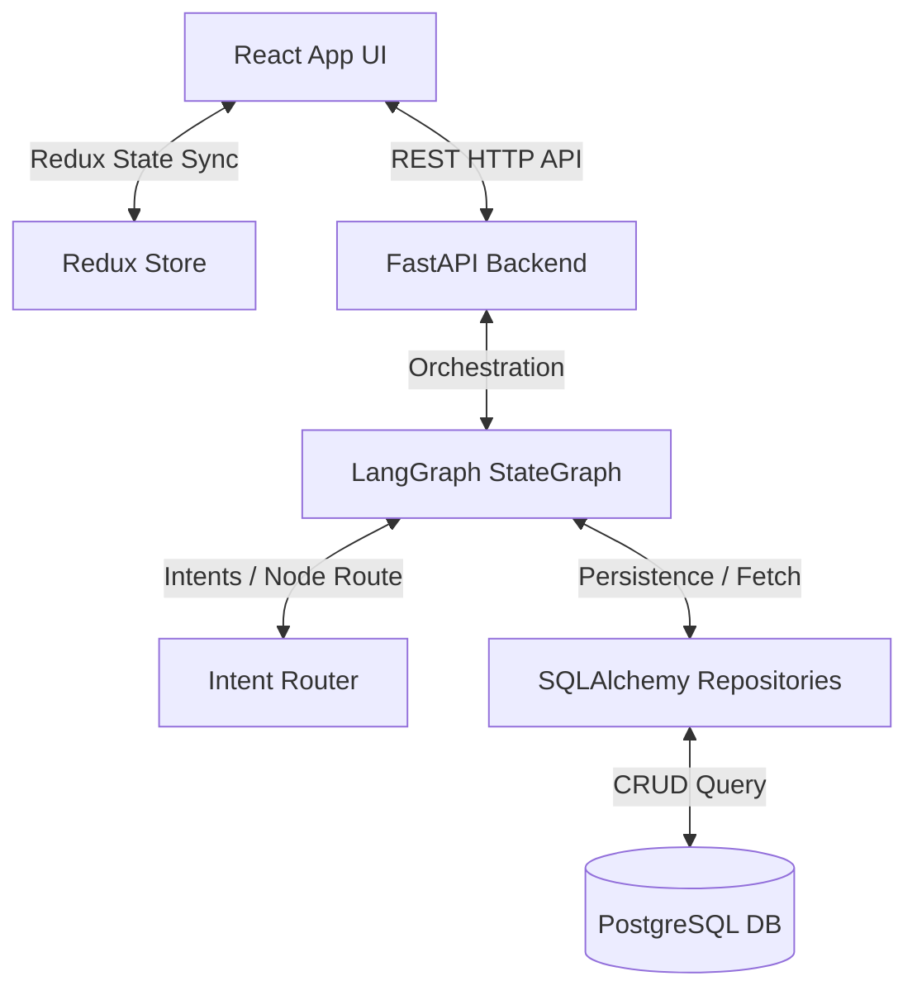

# HCP AI CRM Assistant

An enterprise-grade, voice-enabled Healthcare Professional (HCP) CRM Assistant. This application utilizes a dynamic, multi-agent AI assistant powered by FastAPI, React, Redux, LangGraph, and PostgreSQL to streamline and automate HCP meeting log processes.

---

## Project Overview

Logging and updating Healthcare Professional (HCP) interactions is a time-consuming administrative task for medical representatives. This application acts as a smart conversational agent that parses, logs, searches, and modifies HCP interaction data from natural language, voice inputs, and follow-ups.

---

## Features

- **Dynamic AI Agent Workflow**: Powered by LangGraph conditional routing and LLM intent classification.
- **Persistent Storage**: Robust data layer using SQLAlchemy, Alembic migrations, and PostgreSQL.
- **Voice Summarization**: Conversational transcription parsing using browser-native Speech-to-Text.
- **AI-Powered Search & History**: Query logged meeting details using natural language queries.
- **State Synchronization & Memory**: Preserves context and interaction ID across multi-turn user requests.
- **Responsive Split UI**: Multi-panel layout displaying the form state on the left and the AI Assistant chat on the right.

---

## Tech Stack

### Backend
- **Framework**: FastAPI (Python)
- **Workflow Orchestration**: LangGraph, LangChain
- **AI Models**: Groq (Llama-3.1-8b-instant)
- **Database**: PostgreSQL (SQLAlchemy ORM + Alembic Migrations)

### Frontend
- **Framework**: React (Vite, JavaScript)
- **State Management**: Redux Toolkit (state synchronization)
- **Styling**: Vanilla CSS (highly optimized responsive design)
- **STT**: Browser-native Web Speech API (`SpeechRecognition`)

---

## Architecture Overview



For a detailed architectural breakdown, see [docs/architecture.md](docs/architecture.md).

---

## Folder Structure

```text
hcp-ai-crm/
├── backend/            # FastAPI Backend
│   ├── alembic/        # Alembic database migrations
│   ├── app/            # Main application source code
│   │   ├── api/        # REST route definitions
│   │   ├── db/         # SQLAlchemy connection configs
│   │   ├── langgraph/  # Agent nodes, state & tools
│   │   ├── models/     # DB model definitions
│   │   ├── repositories/ # Repository pattern layer
│   │   ├── services/   # Business logic & responses
│   │   └── utils/      # Helpers (context manager, parsers)
│   └── tests/          # Integration & unit test suite
├── frontend/           # React App Frontend
│   ├── src/            # Source components & assets
│   │   ├── components/ # Form & Chat layout components
│   │   ├── redux/      # Slice store configs
│   │   ├── services/   # Axios API configurations
│   │   └── styles/     # CSS templates
```

For the complete project structure tree, see [docs/project-structure.md](docs/project-structure.md).

---

## Setup & Installation

### Prerequisites
- Python 3.11+
- Node.js 18+
- PostgreSQL 15+

### Setup Guide
Refer to [docs/setup-guide.md](docs/setup-guide.md) for full instructions on configuring the environment variables, setting up the PostgreSQL database, running Alembic migrations, launching frontend/backend servers, and running automated tests.

---

## Documentation Index

Explore the detailed project guides:
- [Setup Guide](docs/setup-guide.md): Environment configs, database setup, and running guide.
- [Architecture](docs/architecture.md): Data flows, LangGraph routing, and Mermaid diagrams.
- [API Reference](docs/api.md): REST endpoints, schemas, payloads, and response contracts.
- [Database](docs/database.md): Database schemas, relationships, indexes, and migrations.
- [Features](docs/features.md): Deep dive into speech, tools, search, and state sync.
- [LangGraph Workflow](docs/langgraph.md): State variables, intent routing, and node mappings.
- [Project Folder Structure](docs/project-structure.md): Code organization and responsibilities.
- [Demo Script](docs/demo-script.md): Scenario walk-through for presentation or grading.

---

## License

This project is licensed under the MIT License.
