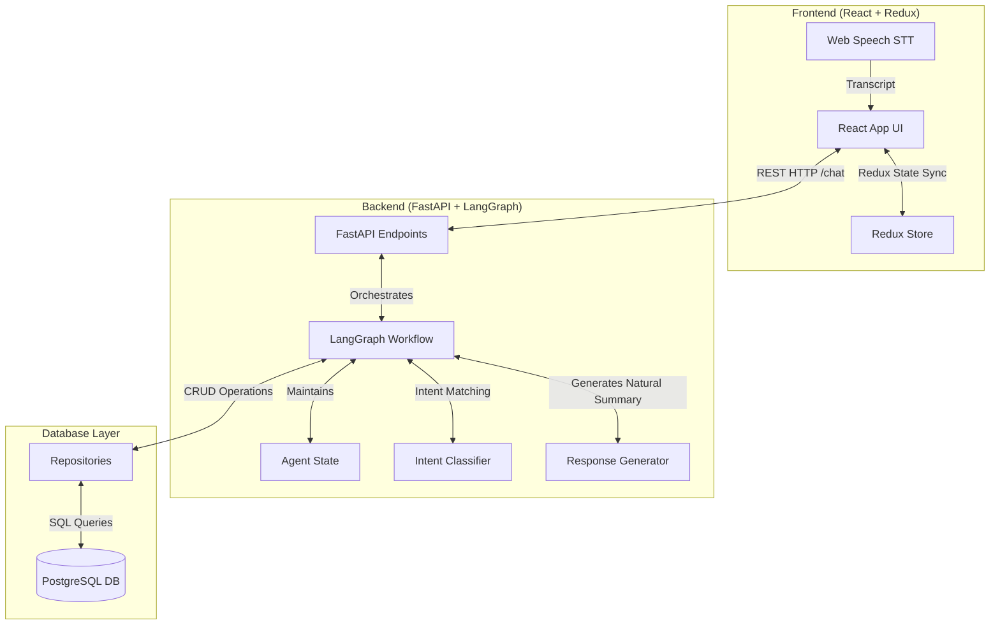
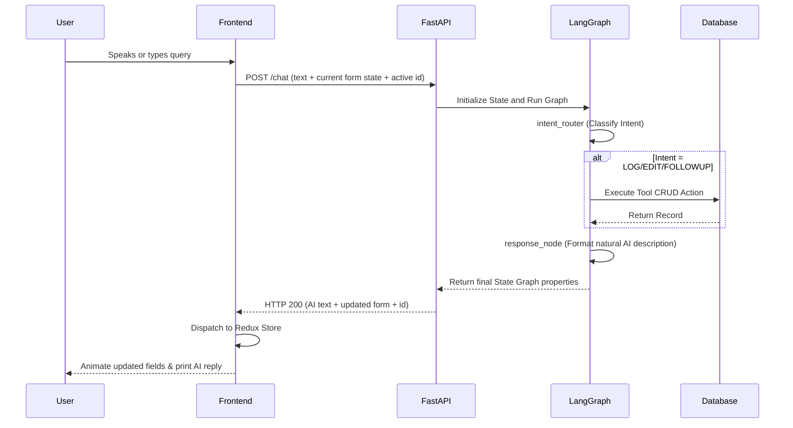
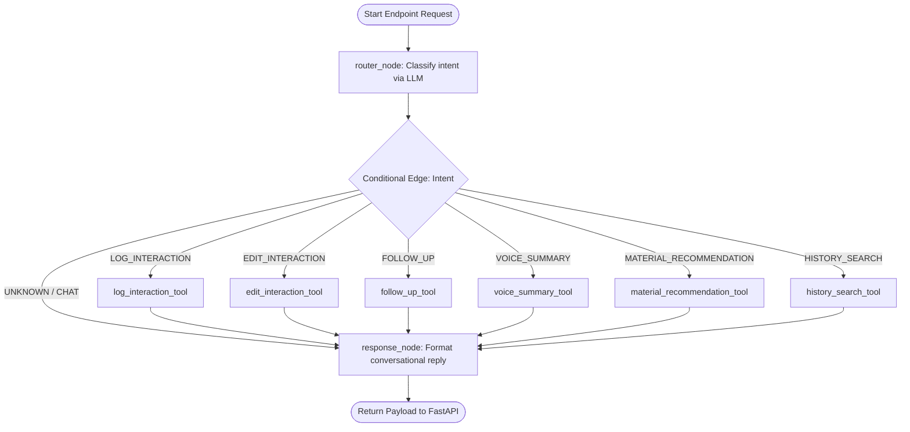

# System Architecture

This document details the architectural layout, data flow pipelines, and execution routing for the HCP AI CRM Assistant.

---

## Overall System Architecture

The project is built on a split-screen single page layout connected to a stateful REST backend using FastAPI and LangGraph:

---

## Core Layers Description

### 1. Presentation Layer (React + Redux)
- **React Components**: Splits viewport into left-side read-only form cards ([InteractionForm.jsx](file:///c:/Users/LENOVO/Downloads/hcp-ai-crm/frontend/src/components/InteractionForm/InteractionForm.jsx)) and right-side interactive workspace ([ChatPanel.jsx](file:///c:/Users/LENOVO/Downloads/hcp-ai-crm/frontend/src/components/ChatPanel/ChatPanel.jsx)).
- **Redux Slice Store**: Synchronizes interaction IDs, form state extractions, memory metadata, and loading statuses in a single unified state manager ([interactionSlice.js](file:///c:/Users/LENOVO/Downloads/hcp-ai-crm/frontend/src/redux/interactionSlice.js)).

### 2. Service Orchestration Layer (FastAPI + LangGraph)
- **FastAPI Router**: Listens on POST `/chat`, parses inputs, loads context, and triggers the asynchronous LangGraph execution block.
- **LangGraph StateGraph**: Models the agent's workflow as a directed graph. The state structure represents a memory buffer that flows between Intent Router, Tool Executions, and Response Nodes.

### 3. Data Persistence Layer (SQLAlchemy + Repository + PostgreSQL)
- **SQLAlchemy Models**: Defines DB entities mapped cleanly to PostgreSQL schemas. Includes dynamic datatype bindings for JSON array structures.
- **Repository Pattern**: Encapsulates DB logic inside `InteractionRepository`, protecting caller service loops from SQL driver changes.

---

## Detailed Data Flows

### Request-Response Flow

### LangGraph Workflow & Tool Routing

