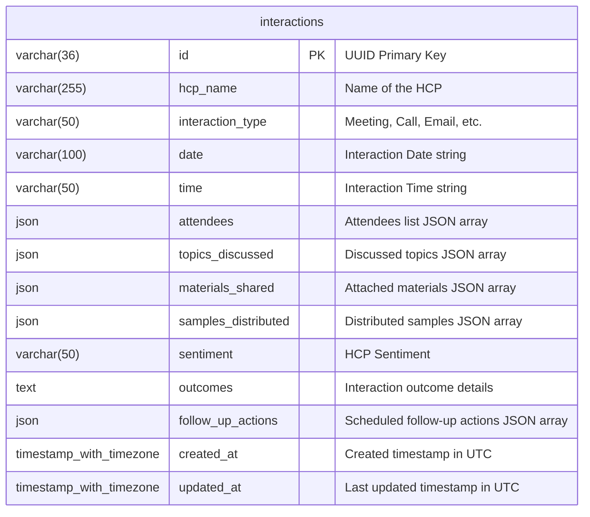

# Database Documentation

This document describes the database design, schema tables, indexes, and migration strategies for the PostgreSQL database.

---

## Database ER Overview
The application maintains a single, stateful table named `interactions` that stores HCP meeting log entities.

---

## Schema definition (interactions Table)



---

## Field Descriptions

| Column | Data Type | Constraint | Default | Description |
| :--- | :--- | :--- | :--- | :--- |
| **`id`** | `VARCHAR(36)` | `PRIMARY KEY` | *UUID String* | Unique ID for the interaction log record. |
| **`hcp_name`** | `VARCHAR(255)` | `NULL` | `None` | Name of the target healthcare provider (HCP). |
| **`interaction_type`** | `VARCHAR(50)` | `NULL` | `"Meeting"` | Format of interaction. |
| **`date`** | `VARCHAR(100)` | `NULL` | `None` | Structured date (e.g. `07/10/2026`). |
| **`time`** | `VARCHAR(50)` | `NULL` | `None` | Structured time (e.g. `14:00`). |
| **`attendees`** | `JSON` | `NOT NULL` | `[]` | JSON array containing strings of attendees. |
| **`topics_discussed`** | `JSON` | `NOT NULL` | `[]` | JSON array containing strings of clinical topics discussed. |
| **`materials_shared`** | `JSON` | `NOT NULL` | `[]` | JSON array containing strings of shared brochure materials. |
| **`samples_distributed`**| `JSON` | `NOT NULL` | `[]` | JSON array containing strings of distributed product samples. |
| **`sentiment`** | `VARCHAR(50)` | `NULL` | `None` | HCP Sentiment (Positive, Neutral, Negative). |
| **`outcomes`** | `TEXT` | `NULL` | `None` | Text description containing clinical outcomes or meeting notes. |
| **`follow_up_actions`** | `JSON` | `NOT NULL` | `[]` | JSON array containing follow-up scheduling strings. |
| **`created_at`** | `TIMESTAMP WITH TZ` | `NOT NULL` | *UTC Now* | Database insertion timestamp. |
| **`updated_at`** | `TIMESTAMP WITH TZ` | `NOT NULL` | *UTC Now* | Last modification timestamp. |

---

## Migration Strategy

### Alembic Migrations
- Migration files are stored inside [backend/alembic/versions/](file:///c:/Users/LENOVO/Downloads/hcp-ai-crm/backend/alembic/versions/).
- Connection URLs are loaded dynamically from environment variables, eliminating hardcoded passwords in version control.
- Executing migrations:
  ```bash
  alembic upgrade head
  ```
