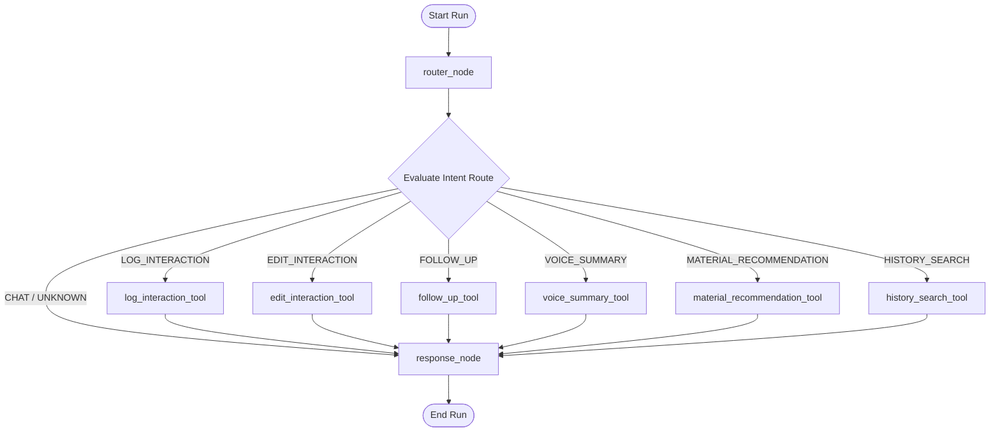

# LangGraph Workflow & State Orchestration

This document details the LangGraph agent architecture, state management variables, intent routing mechanics, and node structures.

---

## State definition (AgentState)

The agent's state is modeled in Python using a stateful dictionary definition. It maintains conversational memory, form variables, and routing logs:

```python
class AgentState(TypedDict):
    user_input: str             # Raw text query or transcript from user
    intent: str                 # Classified intent (e.g. LOG_INTERACTION)
    selected_tool: str          # Name of the active tool executing
    extracted_data: dict        # Cumulative interaction details dictionary
    response: str               # Output text returned to user
    interaction_id: str         # Database UUID of active interaction
    last_intent: str            # Intent of preceding turn
    last_tool: str              # Tool executed in preceding turn
    last_response: str          # Response returned in preceding turn
```

---

## Graph Workflow Map

The following flowchart maps out node transitions and routing branches:



---

## Nodes & Logic

### 1. `router_node`
Acts as the entry node. Executes a Groq LLM chain to analyze `user_input` and classify intent.
- **Supported Intents**:
  - `LOG_INTERACTION`: User wants to record a new meeting log.
  - `EDIT_INTERACTION`: User wants to update details on the active form.
  - `FOLLOW_UP`: User wants to schedule, change, view, or remove a follow-up.
  - `VOICE_SUMMARY`: User requested a voice note summary.
  - `MATERIAL_RECOMMENDATION`: User is searching the material catalogue.
  - `HISTORY_SEARCH`: User wants to query previously logged interactions.
  - `UNKNOWN`: Default fallback for conversational chat.

### 2. Tool Nodes (Conditional Routing)
If an intent maps to a specific action, the graph routes the message to the corresponding tool:
- **`log_interaction_tool`**: Generates a database row and extracts interaction variables.
- **`edit_interaction_tool`**: Pulls the active row and applies requested modifications.
- **`follow_up_tool`**: Edits the follow-up list on the active database row.
- **`voice_summary_tool`**: Summarizes verbal transcripts.
- **`material_recommendation_tool`**: Queries and recommends product documents.
- **`history_search_tool`**: Searches past interactions using natural query parameters.

### 3. `response_node`
Acts as the exit node. Standardizes status responses (e.g. `"✅ Interaction updated successfully."`) into natural, conversational, context-aware paragraphs using the Groq API.
*Note: In unit testing environments, this node bypasses the LLM chain if `IS_TESTING=True` is defined in order to prevent mock sequence conflicts.*
